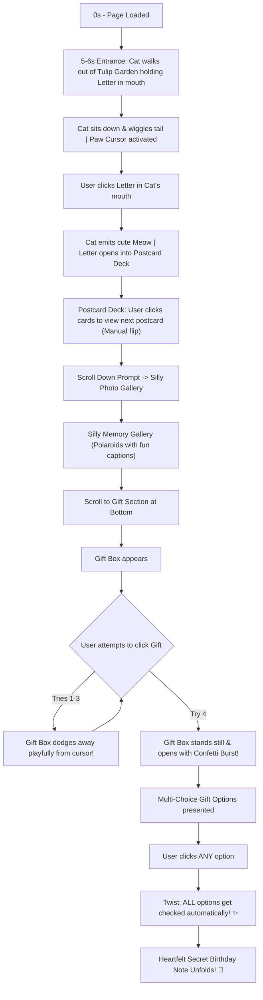

# 🌸 Birthday Cat & Tulip Garden Interactive Experience — Plan & Architecture

> **Concept**: A magical, playful, and heartwarming interactive birthday web application featuring a cute cat emerging from a vibrant tulip garden, a custom paw cursor, an interactive postcard deck, a silly memory gallery, a playful dodging gift box mini-game, and a wholesome secret note twist.

---

## 🎨 Visual Design System & Aesthetics

```
┌─────────────────────────────────────────────────────────────────────────────┐
│                            COLOR PALETTE (OKLCH)                            │
├─────────────────────────────────────────────────────────────────────────────┤
│  🌷 Tulip Pink:       oklch(0.72 0.18 350)  │ #FF80AB                       │
│  🌿 Garden Emerald:   oklch(0.55 0.14 150)  │ #2E7D32                       │
│  ✨ Warm Golden Cream:oklch(0.96 0.05 85)   │ #FFF8E7                       │
│  🐈 Soft Cat Peach:   oklch(0.88 0.09 60)   │ #FFE0B2                       │
│  💜 Dreamy Lavender:  oklch(0.78 0.12 290)  │ #E1BEE7                       │
└─────────────────────────────────────────────────────────────────────────────┘
```

* **Typography**: *Outfit* / *Plus Jakarta Sans* for clean, modern headings and *Sacramento* / *Caveat* for handwritten postcard notes.
* **Custom Cursor**: Interactive cat paw cursor (`cursor: url('paw.svg'), auto`) with soft click ripple effects and cute sound triggers.
* **Atmosphere**: Glassmorphic overlays, floating tulip petals, soft ambient glow, and micro-animations.

---

## 🧭 Step-by-Step User Flow & Core Features



---

## 🛠️ Detailed Functional Modules

### 1. 🌷 Tulip Garden & Cat Opening Scene (0s – 6s)
* **Visual Scene**: An animated vector tulip garden background with swaying flowers, floating butterflies, and a subtle breeze.
* **Cat Animation Sequence**:
  - **0s - 3.5s**: A cute cat smoothly walks out from behind a central cluster of blooming tulips, carrying a sealed wax-stamped envelope in her mouth.
  - **3.5s - 5.5s**: Cat steps into the foreground center, sits down smoothly, and gently rests the envelope in her mouth.
  - **5.5s+**: Idle state with tail wiggling, blinking eyes, and a glowing highlight around the letter signaling "Click Me!".

### 2. 🐾 Paw Cursor & Interactive Postcards
* **Custom Paw Cursor**: A custom SVG cat paw cursor tracking mouse movements. On click, the paw pad squishes softly with a tiny purr/meow sound effect.
* **Letter Opening**: Clicking the envelope plays a gentle paper unfold animation and a soft meow audio effect.
* **Postcard Stack**:
  - Displays a stack of vintage/pastel styled postcards.
  - Cards do **NOT** auto-advance on a timer; the user has full control.
  - Clicking anywhere on the active card triggers a 3D page-flip / slide transition to reveal the next card.
  - Controls allow replaying or flipping back.

### 3. 📸 Silly Photo Memories Gallery
* **Layout**: A polaroid-style grid/carousel of the birthday person's fun and silly photos.
* **Interactivity**:
  - Subtle random polaroid tilt angles (`rotate(-3deg)`, `rotate(4deg)`).
  - Hovering lifts the polaroid with a soft shadow.
  - Interactive tape/stickers and fun captions underneath each photo.

### 4. 🎁 The Playful Dodging Gift Box Mini-Game
* **Scroll Trigger**: IntersectionObserver detects when the user reaches the bottom gift section.
* **Playful Dodge Logic**:
  - When the user hovers/clicks on the gift box for the **1st, 2nd, and 3rd time**, the box plays a giggle animation and rapidly relocates/dodges 100-150px away!
  - Display playful speech bubbles above the cat (e.g., *"Not so fast! 😹"*, *"Too slow! 🐾"*, *"Okay okay, one more try! 🎁"*).
  - On the **4th attempt**, the box stops dodging, sparkles brightly, and opens upon click with a celebratory confetti explosion.

### 5. 💌 The Surprise "All Options Selected" Twist & Note
* **Choice Selection**: User is presented with 3-4 fun gift choices (e.g. *Option A: Unlimited Hugs*, *Option B: Shopping Spree*, *Option C: Delicious Cake & Treats*).
* **Surprise Twist**: Clicking **ANY** single checkbox automatically checks **ALL** checkboxes with a playful sound effect and sparkling checkmarks!
* **Final Note**: A beautifully animated handwritten birthday letter smoothly unfolds from the opened gift box with personal wishes and a replay button.

### 🔊 Audio & Sound FX Engine (Optional & Toggleable)
* **Web Audio API Synth**: Native browser sound generation (meows, purrs, paper rustles, confetti pops, click sounds) so no missing audio file errors occur.
* **Audio Controls**: Floating mute/unmute music toggle button at top right.

---

## 📂 File & Codebase Structure Plan

```
C:\Users\meow\Desktop\web\
├── index.html          # Main HTML structure with semantic sections
├── style.css           # Vanilla CSS with OKLCH design system, glassmorphism & 3D transforms
├── script.js           # Main application state machine, animations, paw cursor & dodging logic
└── assets/             # SVG graphics, icons, and generated visuals
```

---

## 🚀 Execution Roadmap

1. **Phase 1**: Write `index.html` structure (Intro curtain, Cat & Tulip canvas/SVG container, Postcards modal, Photo gallery, Gift section).
2. **Phase 2**: Write `style.css` (Design tokens, tulip garden styles, cat sprite/SVG positioning, 3D card flips, polaroid frames, paw cursor).
3. **Phase 3**: Write `script.js` (State machine for intro timing, paw cursor tracker, postcard flipper, gift dodge counter, confetti engine, audio synth).
4. **Phase 4**: Test and refine all animations, responsive layouts, and interactions.
